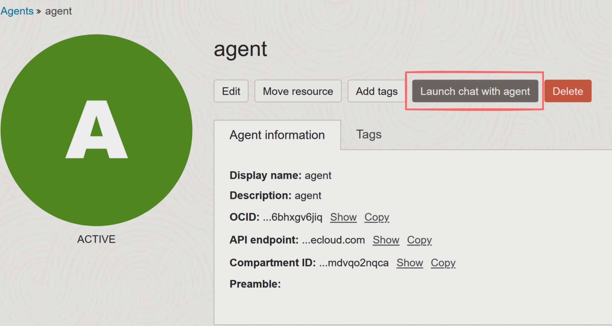
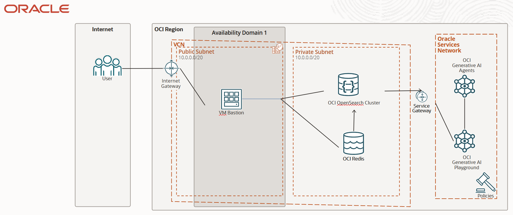

# OCI Retrieval-Augmented Generations (RAG) with Generative AI Agents Service

[](https://img.shields.io/badge/license-UPL-green) [](https://sonarcloud.io/dashboard?id=oracle-devrel_oci-rag-vectordb)

## Introduction

RAG is one of the most coveted use cases nowadays for AI. The great thing about RAG is that it allows you to augment the knowledge of an LLM without having to retrain it. How, you may ask? Well, it's a way for the LLM to extract information (like a database) and present this information to the user very quickly.

This allows LLMs to acquire up-to-date knowledge, for example, the results of this year's SuperBowl, regardless of when the LLM you're running inference against has been trained. Therefore, you can make your LLM more intelligent and provide it with updated data with little to no effort.

Luckily, OCI GenAI Agents Service allows us to do just that: we will be able to upload our documents, process this data, put it into an Index Store (OCI OpenSearch), create a Redis cluster for caching purposes, and provide users with a way to **consume** this data through a chatbot!

For the infrastructure, we will have the following OCI Services present:

- **OCI Redis** for caching user-agent interactions (so we can give some context to the model as well)
- **OCI OpenSearch Cluster** for Index Similarity Search (Index Database) and storing indices with data (Vector Stores will be available in upcoming releases)
- **OCI Compute** for connecting to the OpenSearch cluster securely (through OCI private subnet routing)
- **OCI Generative AI Agents** for communicating and interacting with the data in our cluster

Oracle Cloud Infrastructure Generative AI Agents (Beta) is a fully managed service that combines the power of large language models with an intelligent retrieval system to create contextually relevant answers by searching your knowledge base, making your AI applications smart and efficient.

To use this service, index your data in OCI Search with OpenSearch and set up a cluster in OCI Cache with Redis for the cached user prompts and responses. Then you create an agent and attach your data source. Finally, you test your agent and allow it to generate insights and answer questions. We will see how to do all these steps in this application pattern.

### Use Cases

Use the OCI Generative AI Agents service for the following types of use cases:

- Chatbot for FAQs: Index FAQ and documentation so that users can easily access relevant topics and find answers to their questions through a chatbot or through the current documentation.
- Chatbot for policies: Index policy documents, such as human resources, insurance, or finance documents. When users ask specific questions about these policies, they can get answers relevant answers from those documents through a chatbot interface.

### Available Regions in OCI with the Generative AI Agents Service

Oracle hosts its OCI services in regions and availability domains. A region is a localized geographic area, and an availability domain is one or more data centers in that region. OCI Generative AI Agents is hosted in the following region:

- Region name: US Midwest (Chicago)
- Region identifier: `us-chicago-1`

## 0. Prerequisites and setup

- Oracle Cloud Infrastructure (OCI) Account with available credits to spend
- [Appropriate policies for the GenAI Agents Service](https://docs.oracle.com/en-us/iaas/Content/generative-ai-agents/iam-policies.htm#policies) set up properly within your tenancy
- [Oracle Cloud Infrastructure Documentation - Generative AI Agents](https://docs.oracle.com/en-us/iaas/Content/generative-ai-agents/overview.htm#overview)
- [Oracle Cloud Infrastructure (OCI) Generative AI - Getting Started](https://docs.oracle.com/en-us/iaas/Content/generative-ai-agents/getting-started.htm#get-started)
- [Oracle Cloud Infrastructure (OCI) Generative AI - API](https://docs.oracle.com/en-us/iaas/api/#/en/generative-ai-agents/20240331/)
- [Python 3.10](https://www.python.org/downloads/release/python-3100/)
- [Conda](https://conda.io/projects/conda/en/latest/user-guide/install/index.html)
- [OCI SDK](https://docs.oracle.com/en-us/iaas/Content/API/Concepts/sdkconfig.htm)
- You must have the Chicago region in your tenancy. Generative AI Agents is only available in Chicago.
- You must have an Identity Domain before you create an agent. [Follow the steps here](https://docs.oracle.com/en-us/iaas/Content/generative-ai-agents/getting-started.htm#prereq-domain) to create an Identity Domain within your OCI Account.
- Since this service is in beta at the moment (not for long), it is a Limited Availability service that requires explicit whitelisting for tenancy to have access to the service.

If you've just ran into this README, this is an extension of the functionality present in [this README file](README.md). If you haven't previously set up a GenAI Agent or performed the OCI Cloud setup, please refer to [the README](README.md) to find out how to set everything up to get the resources you need to complete this use case.

Finally, let's install Python dependencies into a local environment (or you can use your OCI Cloud Shell instance for this), to run the Python code found in the `scripts/` folder:

```bash
pip install -r requirements.txt
```

Now, we're ready to start working.

## 1. ORDS Overview

Oracle REST Data Services (ORDS) is a bridge between HTTP and Oracle Databases. In our case, we will be consuming an ORDS endpoint (hosted in the database that contains all F1 laps) and, therefore, we will be able to use this data as soon as it gets to the bastion.

In this case, we will use some data from RedBull Racing laps in the F1 eSports game. See `data/redbull_data.json` for an example of what kind of data we will be storing in our database.

Therefore, all F1 laps are stored into the database, and we are able to consume all these laps from an ORDS endpoint.

1. In order to *manually* consume the endpoint, we can run the following command:

```bash
# obfuscated since it's an unauthenticated rest endpoint
curl -O https://xxxxxxxx.adb.region-name-1.oraclecloudapps.com/ords/f1sim/all_laps/all_json
```

Once we have all laps, we will need perform the following steps on the data:

- Process the JSON object into individual laps
- Stringify-format each lap
- Put each lap into OpenSearch format, ultimately creating a JSON file to mass-insert this data into our OpenSearch cluster
- In the end, we will automatically push new laps into OpenSearch

Remember that the bastion, according to the architecture we've prepared, is the only way to communicate and interact with our OpenSearch cluster. Therefore, we want to consume all laps from our bastion, and insert (the new ones) into the OpenSearch cluster - creating a real-time interaction between laps being inserted into the database, and the LLM's knowledge of these laps.

## 2. Preparing OpenSearch data

This is one data point (one lap) from our dataset:

```json
{
    "ID":99977,
    "R_NAME":"Checo Perez",
    "TRACKNAME":"UNKNOWN",
    "M_SESSION":"1372327188246629453",
    "M_GAMEHOST":"Checo Las Vegas",
    "M_TRACKID":"31",
    "LAP_NUM":1,
    "INVALID_LAP":1,
    "LAP_TIME_DSP":"1:58.727",
    "LAP_TIME_IN_MS":118727,
    "S1":"  57.897",
    "S2":"  36.621",
    "S3":"  24.208",
    "LAP_DATE":"2024-02-15T22:40:44",
    "AVG_LAP_TIME_DSP":"1:45.818",
    "AVG_LAP_TIME":105818,
}
```

Corresponding to a lap that Checo recorded for us, so we have his and Max's laps to compare to event attendees throughout the world during events that we attend to.

Now, this data, in JSON format, has to be put into a specific format (OpenSearch format), more specifically into a JSON file, with one JSON element per line, and one JSON object to represent the metadata (index information) of each lap as well.

In the end, the data should look like this:

```json
{ "index": { "_index": "<index>", "_id": "<id>" } }
{ "A JSON": "document" }
```

In our case:

```json
{"index": {"_index": "redbull", "_id": 99977}}
{"data": "racer id: 99977, racer name: Checo Perez, track name: Texas, invalid lap: 1, total lap time: 1:58.727, sector 1 time: 57.897, sector 2 time: 36.621, sector 3 time: 24.208, lap date: 02/15/2024)"}
```

> **Note**: each JSON lap becomes 2 JSON lines, one for the index name and index ID, and another one for the data. I like putting this data into a single key called `data` but you can also store it into multiple key-value pairs.

This conversion has been implemented in `scripts/consume_ords.py`, in the function called `create_opensearch_format()`.

## 3. Running the pipeline

First, create a file called `auth.yaml` in the root directory of the repository, and put your ORDS endpoint in. My file looks like this:

```yaml
ords_endpoint: https://xxxxxxxx.adb.region-name-1.oraclecloudapps.com/ords/f1sim/all_laps/all_json
ip_address: ip_address (of your OpenSearch bastion)
user: (SSH user for your OpenSearch bastion access)
key_location: (SSH key location for your OpenSearch bastion)
cluster_private_user: opensearch_cluster_username
cluster_private_password: opensearch_cluster_password
```

This file is used in `consume_ords.py` to get the HTTPs endpoint to get all RedBull laps.

Then, we just have to run the following Python script in the environment where we installed all dependencies:

```bash
cd scripts/
python consume_ords.py
```

Note that a mechanism has been created for consistency purposes: a `tinydb` local database file is being used to actively check for new laps, and ignore duplicate laps. Therefore, if you run this step multiple times, it will check for duplicate laps before inserting them again, avoiding duplicate insertions and data redundancy.

This will generate `data/opensearch_redbull_data.json`, in the proper format for OCI OpenSearch. Now that we have our well-formed data, we can create these data sources.

## 4. OpenSearch automatic data ingestion

There are several methods to automate data ingestion, including:

1. We could access the bastion (only way to access the OpenSearch cluster) through SSH, and remotely execute a bash command through the SSH connection, to `scp` copy `opensearch_redbull_data.json`, and then make a HTTP call to insert this file's data in bulk.
2. We could have a FastAPI or similar API server running inside the bastion, and every time we decide to re-run our script, invoke the API to also push this data to OpenSearch automatically.
3. We could expand the existing pipeline we have to create two new functions: `send_file()` and `update_cluster()` and let Python do its job. These two functions will perform the jobs listed in option #1.

Options #1 and #2 are feasible and can be devised in little time, but I have decided to develop this with strategy #3, as it's easier to automate and implement: every time we run the code to check for new laps, these new laps will be automatically inserted into the cluster with the help of Python.

This is how the `send_file()` is implemented. It uses the SFTP protocol to transfer the file from one local directory (the source) to a remote directory (the destination) in our bastion:

```python
def send_file(auth_data: dict, source: str, destination: str):
    # we string build the scp command to copy the file from local to the bastion
    scp_command = """scp -i {} {} {}@{}:{}""".format(
        auth_data['key_location'],
        source,
        auth_data['user'],
        auth_data['ip_address'],
        destination
    )
    # we print it to debug
    print(scp_command)

    # we create an SSH client and, inside it, use its SFTP functionality
    # to send the file.
    ssh_client = paramiko.SSHClient()
    ssh_client.set_missing_host_key_policy(paramiko.AutoAddPolicy())
    ssh_client.connect(auth_data['ip_address'], username=auth_data['user'], key_filename=auth_data['key_location'], password='')
    
    # send the file through SFTP
    ftp_client=ssh_client.open_sftp()
    ftp_client.put(source, destination)
    ftp_client.close()

    return ssh_client

```

And finally, to run the update command into our Index DB in OpenSearch, we have to create `update_cluster()`:

```python
def update_cluster(auth_data: dict, ssh_client: paramiko.SSHClient):
    # this points to the private IP address of the OS cluster (not the bastion's ip address)
    # as this command will be remotely executed within the bastion
    # /redbull/ is the name of the index
    command = """curl -H 'Content-Type: application/x-ndjson' -XPOST https://10.0.3.12:9200/redbull/_bulk?pretty --data-binary @/home/opc/ords/opensearch_redbull_data.json -u {}:{} --insecure""".format(
        auth_data['cluster_private_user'],
        auth_data['cluster_private_password']
    )
    
    ssh_stdin, ssh_stdout, ssh_stderr = ssh_client.exec_command(command)
    print(ssh_stdout.read().decode())
    print(ssh_stderr.read().decode())
```

This function will force the bastion to execute a XPOST command to bulk insert all new laps into the db.

> **Note**: sensitive data shall be stored in your `auth.yaml` file.

## 5. Full automation with crontab

If you want to automate the whole process, without even having to check, I recommend to put this Python script running locally in your machine in a periodic fashion. For that, one of my favorite tools is `crontab` (for Linux, although you can find several alternatives for other operating systems).

With [this tool](https://crontab.guru/) you can generate the crontab that you need to run the Python script in natural language:


1. First, we execute the following command:

    ```bash
    crontab -e # edits the current crontab rules
    ```

2. Then, we can paste the rule, depending on the frequency of executions. We can run it every 30 minutes, every day at 00:00, every week... This depends on how much data is coming into your database, but you're free to choose the cadence:

    ```bash
    0 0 * * * /usr/bin/python /home/$USER/github/oci-rag-vectordb/scripts/consume_ords.py
    ```

The above code will run this script everyday at 00:00, checking for new laps and inserting them.

> **Note**: I recommend that, due to specific things going on under the hood with crontab during the execution of cronjobs, your Python base environment shall have dependencies installed (present in `requirements.txt`). Also, I recommend you also specify the python binary with its full path (you can find it by running `which python` in your terminal.)

Finally, remember to specify the Python script location in absolute terms (not relative ones) as the crontab daemon can lose the current working directory (amongst other things).

We're done with our automation! Congratulations for getting to this point, you've successfully finished a data engineering problem: from ingestion with **ORDS**, to integration with OpenSearch with some Python magic.

## 6. Talk to your new agent

Our agent is now ready! If you haven't previously set up a GenAI Agent, refer to [this README](README.md) to find out how to get started step by step.

We can access our agent and start talking to it - and query about our data:



We observe that, when we make requests about our racers, we receive accurate responses from the Agent, meaning that we've successfully integrated our data source with the Generative AI Agent!

Question: "Can you pull all information you have on racer id 6220?"

> **Note**: you can also refer or query your data with whichever parameters you want. In this case, we've chosen the racer id as it's a unique identifier (sometimes, there are two racers with the same names, which cause confusions if you query them by just their name).


Question: "Can you pull all information you have on racer id 6220?"


Question: "Can you pull all information you have on racer id 10574 and racer id 10304?"


Question: "How about the worst lap recorded for racer id 10304?"


Question: "What can he do to improve his sector 3 time? It was on the Texas F1 Grand Prix. I need recommendations to improve my sector time."


Question: "Considering that both drivers are in the F1 Texas circuit, what can they do to improve the lap times?"


## Demo

[Watch the demo here](https://www.youtube.com/watch?v=JqF6Bc9am4s&list=PLPIzp-E1msraY9To-BB-vVzPsK08s4tQD&index=15)

## Tutorial

[This is a tutorial](https://docs.oracle.com/en/learn/oci-opensearch/index.html#introduction) about OCI OpenSearch if you're interested in learning more about vectorization, indexation, connecting to the cluster, ingesting data, searching for data and visualizing it.

## Physical Architecture



## Contributing

This project is open source. Please submit your contributions by forking this repository and submitting a pull request! Oracle appreciates any contributions that are made by the open source community.

## License

Copyright (c) 2022 Oracle and/or its affiliates.

Licensed under the Universal Permissive License (UPL), Version 1.0.

See [LICENSE](LICENSE) for more details.

ORACLE AND ITS AFFILIATES DO NOT PROVIDE ANY WARRANTY WHATSOEVER, EXPRESS OR IMPLIED, FOR ANY SOFTWARE, MATERIAL OR CONTENT OF ANY KIND CONTAINED OR PRODUCED WITHIN THIS REPOSITORY, AND IN PARTICULAR SPECIFICALLY DISCLAIM ANY AND ALL IMPLIED WARRANTIES OF TITLE, NON-INFRINGEMENT, MERCHANTABILITY, AND FITNESS FOR A PARTICULAR PURPOSE.  FURTHERMORE, ORACLE AND ITS AFFILIATES DO NOT REPRESENT THAT ANY CUSTOMARY SECURITY REVIEW HAS BEEN PERFORMED WITH RESPECT TO ANY SOFTWARE, MATERIAL OR CONTENT CONTAINED OR PRODUCED WITHIN THIS REPOSITORY. IN ADDITION, AND WITHOUT LIMITING THE FOREGOING, THIRD PARTIES MAY HAVE POSTED SOFTWARE, MATERIAL OR CONTENT TO THIS REPOSITORY WITHOUT ANY REVIEW. USE AT YOUR OWN RISK.
