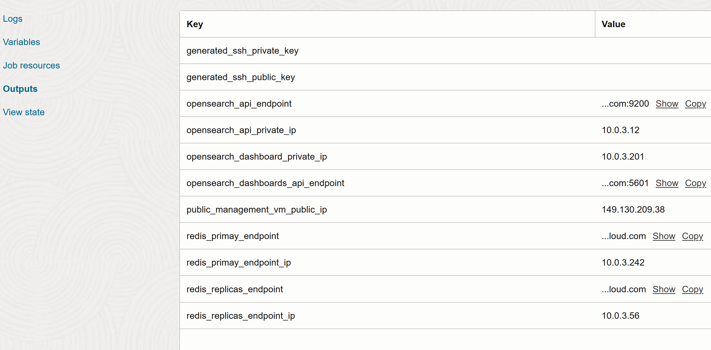
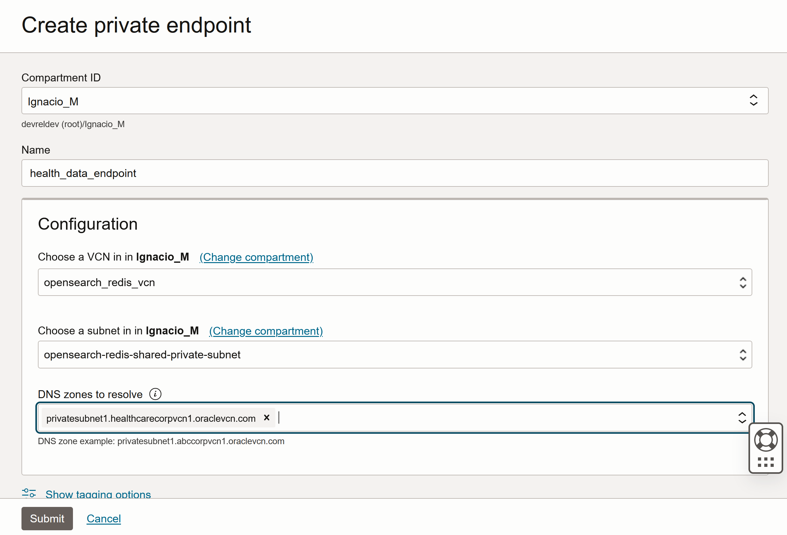
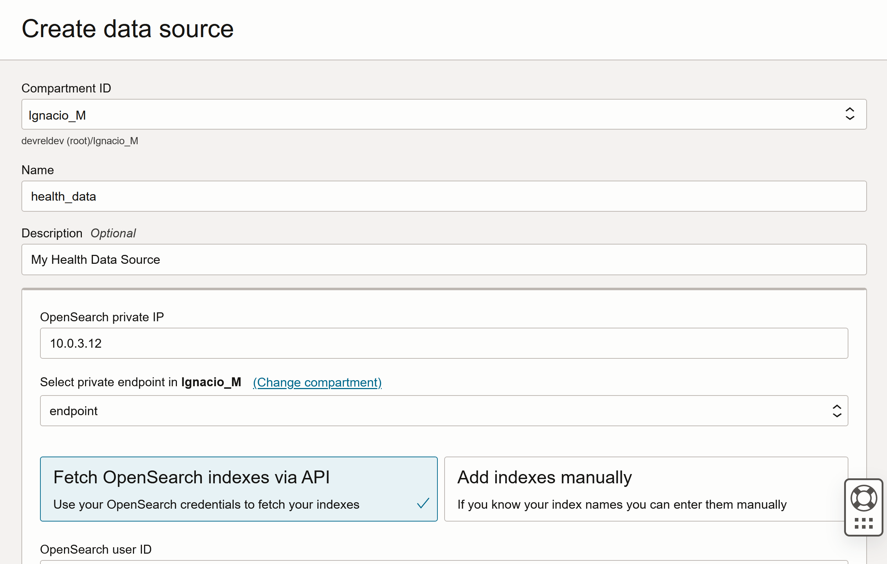
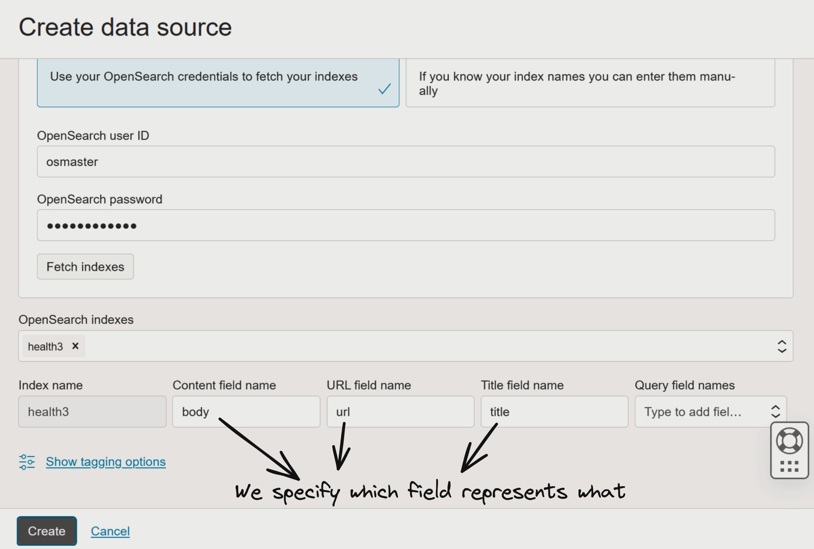
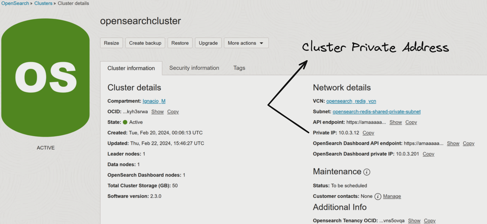
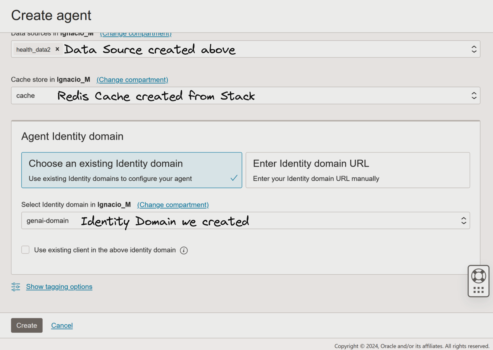
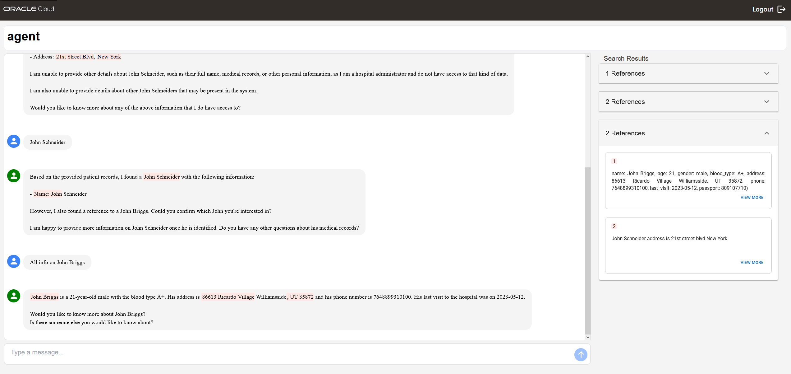

# OCI Retrieval-Augmented Generations (RAG) with Generative AI Agents Service

[](https://img.shields.io/badge/license-UPL-green) [](https://sonarcloud.io/dashboard?id=oracle-devrel_oci-rag-vectordb)

## Introduction

RAG is one of the most coveted use cases nowadays for AI. The great thing about RAG is that it allows you to augment the knowledge of an LLM without having to retrain it. How, you may ask? Well, it's a way for the LLM to extract information (like a database) and present this information to the user very quickly.

This allows LLMs to acquire up-to-date knowledge, for example, the results of this year's SuperBowl, regardless of when the LLM you're running inference against has been trained. Therefore, you can make your LLM more intelligent and provide it with updated data with little to no effort.

Luckily, OCI GenAI Agents Service allows us to do just that: we will be able to upload our documents, process this data, put it into an Index Store (OCI OpenSearch), create a Redis cluster for caching purposes, and provide users with a way to **consume** this data through a chatbot!

For the infrastructure, we will have the following OCI Services present:

- **OCI Redis** for caching user-agent interactions (so we can give some context to the model as well)
- **OCI OpenSearch Cluster** for Index Similarity Search (Index Database) and storing indices with data (Vector Stores will be available in upcoming releases)
- **OCI Compute** for connecting to the OpenSearch cluster securely (through OCI private subnet routing)
- **OCI Generative AI Agents** for communicating and interacting with the data in our cluster

Oracle Cloud Infrastructure Generative AI Agents (Beta) is a fully managed service that combines the power of large language models with an intelligent retrieval system to create contextually relevant answers by searching your knowledge base, making your AI applications smart and efficient.

To use this service, index your data in OCI Search with OpenSearch and set up a cluster in OCI Cache with Redis for the cached user prompts and responses. Then you create an agent and attach your data source. Finally, you test your agent and allow it to generate insights and answer questions. We will see how to do all these steps in this application pattern.

### Use Cases

Use the OCI Generative AI Agents service for the following types of use cases:

- Chatbot for FAQs: Index FAQ and documentation so that users can easily access relevant topics and find answers to their questions through a chatbot or through the current documentation.
- Chatbot for policies: Index policy documents, such as human resources, insurance, or finance documents. When users ask specific questions about these policies, they can get answers relevant answers from those documents through a chatbot interface.

### Available Regions in OCI with the Generative AI Agents Service

Oracle hosts its OCI services in regions and availability domains. A region is a localized geographic area, and an availability domain is one or more data centers in that region. OCI Generative AI Agents is hosted in the following region:

- Region name: US Midwest (Chicago)
- Region identifier: `us-chicago-1`

## 0. Prerequisites and setup

- Oracle Cloud Infrastructure (OCI) Account with available credits to spend
- [Appropriate policies for the GenAI Agents Service](https://docs.oracle.com/en-us/iaas/Content/generative-ai-agents/iam-policies.htm#policies) set up properly within your tenancy
- [Oracle Cloud Infrastructure Documentation - Generative AI Agents](https://docs.oracle.com/en-us/iaas/Content/generative-ai-agents/overview.htm#overview)
- [Oracle Cloud Infrastructure (OCI) Generative AI - Getting Started](https://docs.oracle.com/en-us/iaas/Content/generative-ai-agents/getting-started.htm#get-started)
- [Oracle Cloud Infrastructure (OCI) Generative AI - API](https://docs.oracle.com/en-us/iaas/api/#/en/generative-ai-agents/20240331/)
- [Python 3.10](https://www.python.org/downloads/release/python-3100/)
- [Conda](https://conda.io/projects/conda/en/latest/user-guide/install/index.html)
- [OCI SDK](https://docs.oracle.com/en-us/iaas/Content/API/Concepts/sdkconfig.htm)
- You must have the Chicago region in your tenancy. Generative AI Agents is only available in Chicago.
- You must have an Identity Domain before you create an agent. [Follow the steps here](https://docs.oracle.com/en-us/iaas/Content/generative-ai-agents/getting-started.htm#prereq-domain) to create an Identity Domain within your OCI Account.
- Since this service is in beta at the moment (not for long), it is a Limited Availability service that requires explicit whitelisting for tenancy to have access to the service.

If you haven't already, [follow these instructions](https://docs.oracle.com/en-us/iaas/Content/Identity/domains/to-create-new-identity-domain.htm) to create a sub-identity domain within your OCI tenancy. This is done for authentication purposes, so no user outside the identity domain can access or use our GenAI agent without permission.

Then, [configure client access](https://docs.oracle.com/iaas/Content/Identity/defaultsettings/set-access-signing-certificate.htm) so users can use the signing certificate from IAM without connecting to the identity domain itself.

Instead of doing the whole rest of the infrastructure deployment manually (which includes Cache with Redis and OCI Search with OpenSearch) deploy both things with the following [Terraform stack](https://docs.oracle.com/en-us/iaas/Content/generative-ai-agents/create-stack.htm#create-stack):

1. Download the [prerequisite stack zip file](https://idem3zoqc0ti.objectstorage.us-ashburn-1.oci.customer-oci.com/p/MmUQVkbQKVfQT8V2ItM5Y3wqaM0uzRzpbI6RnFAXYLTL4sjxMcvZGrHtNTp3plKn/n/idem3zoqc0ti/b/genaiagent-service-stack/o/genaiagent-solution-accelerator-quickstart.zip) to your local machine.
2. In the navigation bar of the Console, choose a region that hosts Generative AI Agents, for example, US Midwest (Chicago). If you don't know which region to choose, see [Regions with Generative AI Agents](https://docs.oracle.com/en-us/iaas/Content/generative-ai-agents/overview.htm#regions).
3. Open the navigation menu and click Developer Services. Under Resource Manager, click Stacks.
4. Choose a compartment that you have permission to work in.
5. Click Create stack.
6. For the origin of the Terraform configuration, click My Configuration.
7. Under Stack Configuration, click .Zip file and then browse to or drop the prerequisite zip file from step 1 into the provided area.
8. Keep Custom providers unselected.
9. (Optional) Give the stack a name and description.
10. Choose Terraform version 1.2.x.
11. Click Next.
12. For openid_url, enter [your identity domain URL](https://docs.oracle.com/en-us/iaas/Content/generative-ai-agents/getting-started.htm#prereq-domain). Example URL: `https://idcs-xxxxxxx.identity.oraclecloud.com`.
13. Keep the rest of the defaults and click Next.
14. Click Run apply.
15. Click Create.

## 1. Create/Use data

We will generate some data points for our use case: we want to have **healthcare patient records** with some information from their previous visits. This is information we will give our LLM access to, through our Generative AI Agent, and ask the Agent questions about our patient records - this shows that even if the LLM hasn't trained for solving a specific type of prompt or query, RAG can facilitate this data *instantaneously* to the agent.

To generate data, we will go into our Conda environment and install Python dependencies to produce this data:

```bash
pip install -r requirements.txt
```

After, we can run `data_generator.py`:

```bash
cd scripts/
python data_generator.py
```

The console will ask for how many synthetic users' data you want. For testing purposes, this can be any small value that will let us test; for your own use case in practice, your only job is to select which data will go into the index store (vector store in the upcoming release) database, and in which form (JSON, structured data, raw text... and their properties (if any)).

Finally, we need to run `data_converter.py` to convert the data source into expected OCI OpenSearch format. From the docs, [this is the expected format](https://opensearch.org/docs/latest/im-plugin/) for a JSON Object being inserted in OpenSearch:

```json
{ "index": { "_index": "<index>", "_id": "<id>" } }
{ "A JSON": "document" }
```

For that, we just have to execute the following script, making sure that there's a file called `data/generated_data.json` in your `data/` directory:

```bash
python data_converter.py
```

This will generate `data/opensearch_data.json`, in the proper format for OCI OpenSearch. Now that we have our data properly-formatted, we can create these data sources.

Now that we have our synthetic data ready, we will be able to create a data source in OpenSearch to query against this data.

We need to connect to the VM in the same private subnet as our deployed OpenSearch and Redis cluster; through this VM, we will push the generated data into the OpenSearch cluster:

## 2. Upload data to OpenSearch cluster

We SSH to the VM instance. If you don't remember your creation details, you can go to [your OCI Stacks](https://cloud.oracle.com/resourcemanager/stacks?region=us-chicago-1), click on your Stack, and view the created resources (it will include the instance's IP address and the SSH private key you used upon stack deployment):



```bash
# if you don't have FTP for file transfer, first transfer the file to your VM instance
scp -i <private key file> ./iaas.json opc@<instance’s public ip address>:~/

# then, now that we have the file, SSH into the server
ssh -i <private key file> opc@<instance’s public ip address>
```

We create the search index by running the following command:

```bash
curl -XPUT https://<OPENSEARCH PRIVATE IP ADDRESS>:9200/<NAME OF YOUR ENDPOINT> -u <OPENSEARCH_USER>:<OPENSEARCH_PW> --insecure.
```

For example, something like this:

```bash
curl -XPUT https://10.0.1.0:9200/patients -u myuser:mypassword --insecure
```

Then, we shall load data into this new index:

```bash
curl -H 'Content-Type: application/x-ndjson' -XPOST https://<OPENSEARCH PRIVATE IP ADDRESS>:9200/patients/_bulk?pretty --data-binary @opensearch_data.json -u user:password -–insecure
```

Verify if the data was loaded correctly by running the following command:

```bash
curl -XGET https://<OPENSEARCH PRIVATE IP ADDRESS>:9200/patients/_count?pretty -u 
osmaster:Osmaster@123 -–insecure
```

You should an output similar to this one, if everything was done properly:

```json
{
  "count" : 10,
  "_shards" : {
    "total" : 1,
    "successful" : 1,
    "skipped" : 0,
    "failed" : 0
  }
}
```

## 3. Create endpoint & data source

We will create an endpoint using OCI's Console. Our data will be hosted in this private endpoint, and we'll be able to link this private endpoint with an agent in the next step, in order to interact with our data:



> **Note**: make sure you select the VCN you created in step 0, and select the `private` subnet (not the public one).

Now, we can create the corresponding Data Source. Make sure you reference the index you created on step 2 (in our case called `patients`):





> **Note**: 'OpenSearch Private IP' can be obtained as I do in the picture below:



## 4. Create agent to point to data source and identity domain

Considering we created our Identity Domain in step 0, we will now associate this Identity Domain to our Agent, to restrict access to unauthorized users.

Let's create the agent and point to this created identity domain:



Our agent is now ready!

## 5. Talk to your new agent

We can access our agent and start talking to it - and query about our data:


We observe that, when we make requests about our health patients, we receive accurate responses from the Agent, meaning that we've successfully integrated our data source with the Generative AI Agent!



## Demo

[Watch the demo here](https://www.youtube.com/watch?v=JqF6Bc9am4s&list=PLPIzp-E1msraY9To-BB-vVzPsK08s4tQD&index=15)

## Tutorial

TODO

[This is a tutorial](https://docs.oracle.com/en/learn/oci-opensearch/index.html#introduction) about OCI OpenSearch if you're interested in learning more about vectorization, indexation, connecting to the cluster, ingesting data, searching for data and visualizing it.

## Physical Architecture


## Contributing

This project is open source. Please submit your contributions by forking this repository and submitting a pull request! Oracle appreciates any contributions that are made by the open source community.

## License

Copyright (c) 2022 Oracle and/or its affiliates.

Licensed under the Universal Permissive License (UPL), Version 1.0.

See [LICENSE](LICENSE) for more details.

ORACLE AND ITS AFFILIATES DO NOT PROVIDE ANY WARRANTY WHATSOEVER, EXPRESS OR IMPLIED, FOR ANY SOFTWARE, MATERIAL OR CONTENT OF ANY KIND CONTAINED OR PRODUCED WITHIN THIS REPOSITORY, AND IN PARTICULAR SPECIFICALLY DISCLAIM ANY AND ALL IMPLIED WARRANTIES OF TITLE, NON-INFRINGEMENT, MERCHANTABILITY, AND FITNESS FOR A PARTICULAR PURPOSE.  FURTHERMORE, ORACLE AND ITS AFFILIATES DO NOT REPRESENT THAT ANY CUSTOMARY SECURITY REVIEW HAS BEEN PERFORMED WITH RESPECT TO ANY SOFTWARE, MATERIAL OR CONTENT CONTAINED OR PRODUCED WITHIN THIS REPOSITORY. IN ADDITION, AND WITHOUT LIMITING THE FOREGOING, THIRD PARTIES MAY HAVE POSTED SOFTWARE, MATERIAL OR CONTENT TO THIS REPOSITORY WITHOUT ANY REVIEW. USE AT YOUR OWN RISK.
