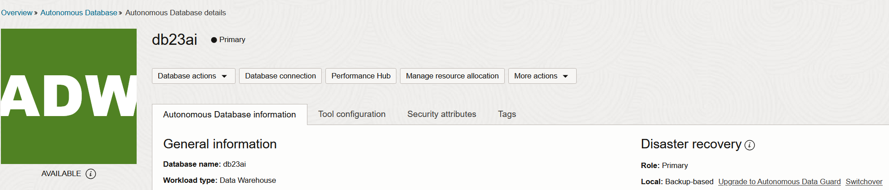
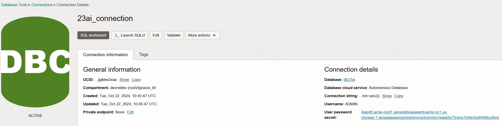

# OCI Retrieval-Augmented Generations (RAG) with Generative AI Agents Service

 

## Introduction

RAG is one of the most coveted use cases nowadays for AI. The great thing about RAG is that it allows you to augment the knowledge of an LLM without having to retrain it. How, you may ask? Well, it's a way for the LLM to extract information (like a database) and present this information to the user very quickly.

This allows LLMs to acquire up-to-date knowledge, for example, the results of this year's SuperBowl, regardless of when the LLM you're running inference against has been trained. Therefore, you can make your LLM more intelligent and provide it with updated data with little to no effort.

Luckily, OCI GenAI Agents Service allows us to do just that: we will be able to upload our documents, process this data, and provide users with a way to **consume** this data through a chatbot!

Here's a list of the most prominent features of the service:

- Supports several data on-boarding methods and interaction channels (chat interface or API)
- Creates contextually relevant answers by searching your knowledge base
- Provides source attribution for every answer
- Offers hybrid search capabilities (lexical and semantic) for more correct answers
- Includes content moderation options for input and output to ensure a safe and respectful chat experience
- Supports multi-turn conversations, where users can ask follow-up questions and receive answers that consider the context of previous questions and answers
- Can interpret data from two-axis charts and reference tables in a PDF, without needing explicit descriptions of the visual elements
- All the hyperlinks present in the PDF documents are extracted and displayed as hyperlinks in the chat response.

For the infrastructure, we have the following OCI Services present:

- **OCI Object Storage** files where you can have up to 1,000 text and PDF files of 100 MB each. And you can request an increase through a limit request. (Fully managed)
- **Oracle Autonomous Database 23AI** for vector search, as an alternative to using OCI Object Storage (Partially managed, see [here](https://docs.public.oneportal.content.oci.oraclecloud.com/en-us/iaas/Content/generative-ai-agents/oracle-db-guidelines.htm) for more information)
- **OCI Search with OpenSearch** for Index Similarity Search (Index Database) and storing indices with data (Requires you to chunk, index and vector-embed the data, a bit more complex)
- **OCI Compute** for connecting to the OpenSearch cluster securely (through OCI private subnet routing)
- **OCI Generative AI Agents** for communicating and interacting with the data in our cluster

In this specific solution, we will use Object Storage as our storage mechanism, as it's the simplest mechanism of the three available (you don't need to do any additional data processing to *consume* the data, unlike with OpenSearch and Autonomous.) although you can always swap into Autonomous 23AI or OCI Search with OpenSearch, provided you setup these data sources correctly. (More info on the docs section)

OCI Generative AI Agents is a fully managed service that combines the power of large language models (LLMs) with an intelligent retrieval system to create contextually relevant answers by searching your knowledge base, making your AI applications smart and efficient.

To use this service, we'll follow these four steps:

1. Create a knowledge base
2. Add your data
3. Create an agent
4. Set up endpoints for user interaction
5. Start chatting

OCI Generative AI Agents takes care of the rest, providing relevant answers to you and your customers' questions, and tracks the conversation context to enable more informed and helpful responses.

### Use Cases

Use the OCI Generative AI Agents service for the following types of use cases:

- Customer Support: In the customer service industry, RAG agents can retrieve information from a company’s knowledge base to provide correct and contextually relevant answers to customer inquiries, reducing response times and improving customer satisfaction.
- Legal Research: Legal professionals can use RAG agents to quickly find precedents and relevant case law from vast legal databases, streamlining the research process and ensuring thorough consideration of relevant legal texts.
- Healthcare and Medical Guidance: In healthcare, RAG agents can help doctors and medical staff by providing diagnostic support, retrieving medical literature, treatment protocols, and patient history to suggest potential diagnoses and treatments.
- Financial Analysis: In finance, RAG agents can analyze large volumes of financial data, reports, and news to provide analysis and recommendations for traders and analysts, helping them make informed investment decisions.
- Educational Tutoring: RAG agents can function as personal tutors, providing students with explanations, resources, and answers to questions by accessing educational content and tailoring explanations to the student’s current level of understanding.
- Content Creation: In media and content creation, RAG agents can help writers and journalists by pulling information on specific topics, suggesting content ideas, and even drafting sections of articles based on the latest data and trends.
- Technical Support and Troubleshooting: RAG agents can guide users through technical troubleshooting processes by accessing and synthesizing technical manuals and support forums to offer step-by-step help.
- Supply Chain Management: In supply chain and logistics, RAG agents can provide insights by retrieving and synthesizing information on inventory levels, supplier data, and logistic metrics to optimize operations and predict potential disruptions.
- Real Estate Market Analysis: RAG agents can help real estate professionals by aggregating and analyzing data from several sources, including market trends, property listings, and regulatory changes, to provide comprehensive market analyses.
- Travel Planning and Help: In the travel industry, RAG agents can serve as interactive travel guides, pulling information on destinations, weather, local attractions, and regulations to provide personalized travel advice and itineraries.

### Available Regions in OCI with the Generative AI Agents Service

Oracle hosts its OCI services in regions and availability domains. A region is a localized geographic area, and an availability domain is one or more data centers in that region. OCI Generative AI Agents is hosted in the following region:

- Region name: US Midwest (Chicago)
- Region identifier: `us-chicago-1`

## 0. Prerequisites and setup

### Prerequisites

- Oracle Cloud Infrastructure (OCI) Account with available credits to spend
- [Appropriate policies for the GenAI Agents Service](https://docs.oracle.com/en-us/iaas/Content/generative-ai-agents/iam-policies.htm#policies) set up properly within your tenancy
- [Oracle Cloud Infrastructure Documentation - Generative AI Agents](https://docs.public.oneportal.content.oci.oraclecloud.com/en-us/iaas/Content/generative-ai-agents/home.htm)
- [Python 3.10](https://www.python.org/downloads/release/python-3100/)
- [Conda](https://conda.io/projects/conda/en/latest/user-guide/install/index.html)
- [OCI SDK](https://docs.oracle.com/en-us/iaas/Content/API/Concepts/sdkconfig.htm)
- You must be subscribed to the Chicago region in your tenancy. Generative AI Agents is only available in Chicago at this moment.
- You must have an Identity Domain before you create an agent. [Follow the steps here](https://docs.oracle.com/en-us/iaas/Content/generative-ai-agents/getting-started.htm#prereq-domain) to create an Identity Domain within your OCI Account.

### Docs

- [OCI Object Storage Guidelines in Generative AI Agents](https://docs.public.oneportal.content.oci.oraclecloud.com/en-us/iaas/Content/generative-ai-agents/data-requirements.htm#data-requirements)
- [OCI Search with OpenSearch Guidelines for Generative AI Agents](https://docs.public.oneportal.content.oci.oraclecloud.com/en-us/iaas/Content/generative-ai-agents/opensearch-guidelines.htm#opensearch-guide)
- [Oracle Database Guidelines for Generative AI Agents](https://docs.public.oneportal.content.oci.oraclecloud.com/en-us/iaas/Content/generative-ai-agents/oracle-db-guidelines.htm)
- [Oracle Cloud Infrastructure (OCI) Generative AI - Getting Started](https://docs.oracle.com/en-us/iaas/Content/generative-ai-agents/getting-started.htm#get-started)
- [Oracle Cloud Infrastructure (OCI) Generative AI - API](https://docs.oracle.com/en-us/iaas/api/#/en/generative-ai-agents/20240331/)
- [OCI GenAI Agents - Concepts](https://docs.public.oneportal.content.oci.oraclecloud.com/en-us/iaas/Content/generative-ai-agents/concepts.htm#concepts)
- [Search and Visualize Data using Oracle Cloud Infrastructure Search with OpenSearch](https://docs.oracle.com/en/learn/oci-opensearch/index.html)

### Setup

1. If you don't have access in your tenancy to the service, sign up for the [Beta program](https://apexadb.oracle.com/ords/f?p=108:501:508002131060566::::P501_SELF_NOMINATION:Self-Nomination) and download the Source Development Kit after you've been approved.
2. In the navigation bar of the Console, choose a region that hosts Generative AI Agents - for example, US Midwest (Chicago). If you don't know which region to choose, see [Regions with Generative AI Agents](https://docs.oracle.com/en-us/iaas/Content/generative-ai-agents/overview.htm#regions).

Finally, if you want to use the GenAI Agents service with **Object Storage** buckets, create a bucket where you'll store your files:

Some considerations for which files are allowed to be used as data in the bucket:

- Supported File Types: Only **PDF** and **txt** files are supported.
- File Size Limit: Each file must be no larger than **100 MB**.
- PDF Contents: PDF files can include images, charts, and reference tables but these must not exceed **8 MB**.
- Chart Preparation: No special preparation is needed for charts, as long as they're **two-dimensional** with **labeled axes**. The model can answer questions about the charts without explicit explanations.
- Table Preparation: Use reference tables with several rows and columns. For example, the agent can read the table [on this website](https://docs.public.oneportal.content.oci.oraclecloud.com/en-us/iaas/Content/generative-ai-agents/limits.htm#limits).
- URLs: All the hyperlinks present in the PDF documents are extracted and displayed as hyperlinks in the chat response.

## 1. Create knowledge base & data source

On the Knowledge Bases list page, click *Create knowledge base*.
Enter the following values:
  - **Name**: A name that starts with a letter or underscore, followed by letters, numbers, hyphens, or underscores. The length can be from 1 to 255 characters.
  - **Compartment**: The compartment that you want to store the knowledge base in
  - **Description**: An optional description

Select one of the following options for the data store type.

  - Object Storage (recommended)
  - OCI OpenSearch: you must have documents chunked to files with less than 512 tokens each, ingested and indexed those documents in OpenSearch before you continue. See [OCI Search with OpenSearch Guidelines for Generative AI Agents](https://docs.public.oneportal.content.oci.oraclecloud.com/en-us/iaas/Content/generative-ai-agents/opensearch-guidelines.htm#opensearch-guide) for more information.
  - Oracle AI Vector Search: this option is to ask about data already present in Oracle Database 23ai. See [Oracle Database Guidelines for Generative AI Agents](https://docs.public.oneportal.content.oci.oraclecloud.com/en-us/iaas/Content/generative-ai-agents/oracle-db-guidelines.htm) for the required setup.

### (Recommended) (Option 1) Object Storage Knowledge Base

If you selected Object Storage, perform the following actions:

- Select **Enable hybrid search** to combine lexical and semantic search. Without hybrid search, you get lexical search only.
- Select Specify data source and enter a name and optional description for the data source, if you haven't created one before.
- Select the bucket that contains the data for the knowledge store. Change the compartment if the bucket is in another compartment.
- After the contents of the bucket are listed, perform one of the following actions:
  - Select all in bucket
  - Select the files and folders to include.
- Click Create.
- (Optional) Select *Automatically start ingestion job* for above data sources. If you don't select this option, you must ingest the data later for your agent to use it. 

> **Note**: you can only have one data source per knowledge base. If you're going to reuse your knowledge base (uploading more documents to your bucket), you'll need to create an ingestion job manually within the knowledge base, to update the model's knowledge:

Then, after creating an ingestion job:

- Review the status logs to confirm that all updated files were successfully ingested.
- If the ingestion job fails (for example, because of a file being too large), address the issue and restart the job.

> **Note**: When you restart a previously run ingestion job, the pipeline detects files that were successfully ingested earlier and skip them; while only ingesting files that failed previously and have since been updated.

### (Option 2) OCI Search with OpenSearch Knowledge Base

Enter the following information:

- OpenSearch cluster name
- OpenSearch index information:
  - **Index** Name: the name of the index to look for.
  - **Body** key: the field that contains the vector.
  - Embed body key (Optional)
  - URL key (Optional)
  - Title key (Optional)
- For **Secret details** select one of the following options:
  - *Basic* auth secret: For this option, select the Vault secret for OCI Search with OpenSearch.
  - *IDCS* secret: For this option enter the following information for the IDCS confidential application that you want to use for the agent:
    - **Identity domain** application name - Change the compartment if the identity domain is in another compartment.
    - **Client ID** for the OpenSearch cluster's IDCS client application.
    - **Client secret** vault that contains the client secret - Change the compartment if the secret is in another compartment.
    - **Scope URL** that's the API endpoint for the identity domain's resource server application and includes the agent scope. For example, for genaiagent scope, the URL is `https://*.agent.aiservice.us-chicago-1.oci.oraclecloud.com/genaiagent`.

    Take a look at [this docs page](https://docs.public.oneportal.content.oci.oraclecloud.com/en-us/iaas/Content/search-opensearch/Tasks/get-opensearch-cluster.htm) to learn about OpenSearch clusters and be able to get the cluster's details.

### (Option 3) Autonomous Database 23AI Knowledge Base

If you selected **Oracle AI Vector Search**, you'll need to have a 23AI Autonomous Database instance created. If you haven't create one now:

Then, create a **connection** to this database. You can see your connections under the [`Database Tools`](https://cloud.oracle.com/dbtools/connections) menu:

Now that we have a connection created, select the Database tool connection and then click **Test connection** to confirm a successful connection to the database. If successful, the database name and version is displayed. Then, enter the Vector search function for the database tool connection.

> **Note**: see the [Oracle Database Guidelines for Generative AI Agents](https://docs.public.oneportal.content.oci.oraclecloud.com/en-us/iaas/Content/generative-ai-agents/oracle-db-guidelines.htm) to help you enter the values for this step.

## 2. Create agent

Now, we need to create the agent, which will associate with one of our knowlegde bases:

Select the *Automatically create an endpoint for this agent* option to avoid later having to manually setup the endpoint.

> **Note**. You can customize the welcome message when interacting with the user through chat.

## 3. Start chatting

Now that our agent is created, we can start talking to it!

## 4. Talk to your new agent

We can access our agent and start talking to it - and query about our data:

From our patient data:

Apart from patient data in the hospital, I can also ask questions about best practices, policies, and intricacies of legal documents. Anyone with doubts can come chat with the agent and leave with accurate and verifiable responses:

From the original documents, we see the response is accurate:

We observe that, when we ask the model anything present in our documents or data in Object Storage, it's able to gather the necessary bits and pieces from one (or multiple) files and return a well-formed response, taking into consideration all our data. In the example above, I had uploaded a 75-page scientific paper called *"Language Models are Few-Shot Learners"*, and ask complex questions:

But this can be applied to any domain: if you have your own data, you'll receive accurate responses from the agent (as well as some references so you can check the veracity of the model's responses) meaning that we've successfully integrated our data source with the Generative AI Agent!

## Demo

[Watch the demo here](https://www.youtube.com/watch?v=JqF6Bc9am4s&list=PLPIzp-E1msraY9To-BB-vVzPsK08s4tQD&index=15)

## Physical Architecture

## Contributing

This project is open source. Please submit your contributions by forking this repository and submitting a pull request! Oracle appreciates any contributions that are made by the open source community.

## License

Copyright (c) 2022 Oracle and/or its affiliates.

Licensed under the Universal Permissive License (UPL), Version 1.0.

See [LICENSE](LICENSE) for more details.

ORACLE AND ITS AFFILIATES DO NOT PROVIDE ANY WARRANTY WHATSOEVER, EXPRESS OR IMPLIED, FOR ANY SOFTWARE, MATERIAL OR CONTENT OF ANY KIND CONTAINED OR PRODUCED WITHIN THIS REPOSITORY, AND IN PARTICULAR SPECIFICALLY DISCLAIM ANY AND ALL IMPLIED WARRANTIES OF TITLE, NON-INFRINGEMENT, MERCHANTABILITY, AND FITNESS FOR A PARTICULAR PURPOSE.  FURTHERMORE, ORACLE AND ITS AFFILIATES DO NOT REPRESENT THAT ANY CUSTOMARY SECURITY REVIEW HAS BEEN PERFORMED WITH RESPECT TO ANY SOFTWARE, MATERIAL OR CONTENT CONTAINED OR PRODUCED WITHIN THIS REPOSITORY. IN ADDITION, AND WITHOUT LIMITING THE FOREGOING, THIRD PARTIES MAY HAVE POSTED SOFTWARE, MATERIAL OR CONTENT TO THIS REPOSITORY WITHOUT ANY REVIEW. USE AT YOUR OWN RISK.
